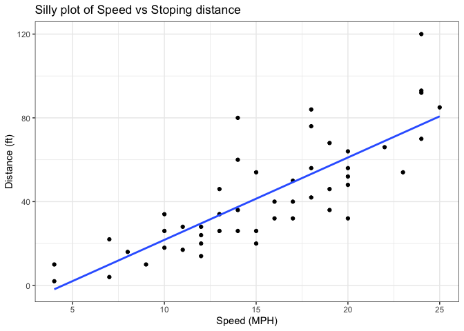
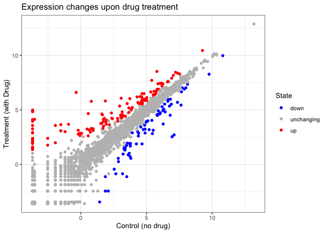

# Class 5: Data Viz with ggplot
Nicole (A18116280)

Today we are exploring the **ggplot** package and how to make nice
figures in R.

There are lots of ways to make figures and plots in R. These include:

- so called “base” R
- and add on packages like **ggplot2**

Here is a simple “base” R plot.

``` r
head(cars)
```

      speed dist
    1     4    2
    2     4   10
    3     7    4
    4     7   22
    5     8   16
    6     9   10

We can simply pass to the `plot()` function.

``` r
plot(cars)
```


> Key-point: Base R is quick but not so nice looking in some folks eyes.

Let’s see how we can plot this with **ggplot2**…

1st I need to install this add-on package. For this we use the
`install.package()` function - **WE DO THIS IN THE CONSOLE, NOT our
report**. This is a one time only deal.

2nd we need to load the package with the `library()` functino every time
we want to use it.

``` r
library(ggplot2)
ggplot(cars)
```


Every ggplot is composed of at least 3 layers:

- **data** (i.e a data.frame with the things you want to plot),
- aesthitics **aes()** that map the columns of data to your plot
  features (i.e. aesthitics)
- geoms like **geom_point()** that srt how the plot appears

``` r
ggplot(cars) + 
  aes(x=speed, y=dist) +
  geom_point()
```


``` r
hist(cars$speed)
```


> For simple “canned” graphs base R is quicker but as things get more
> custom and elaborate then ggplot wins out…

Let’s add more layers to our ggplot

Add a line showing the relationship between x and y Add a title Add
custom axis labels “Speed (MPH)” and “Distance (ft)” Change the theme…

``` r
ggplot(cars) + 
  aes(x=speed, y=dist) +
  geom_point() + 
  geom_smooth(method=lm, se=FALSE) +
  labs(title="Silly plot of Speed vs Stoping distance", 
       x="Speed (MPH)", 
       y="Distance (ft)") + 
  theme_bw()
```

    `geom_smooth()` using formula = 'y ~ x'



## Going further

Read some gene expression data

``` r
url <- "https://bioboot.github.io/bimm143_S20/class-material/up_down_expression.txt"
genes <- read.delim(url)

head(genes)
```

            Gene Condition1 Condition2      State
    1      A4GNT -3.6808610 -3.4401355 unchanging
    2       AAAS  4.5479580  4.3864126 unchanging
    3      AASDH  3.7190695  3.4787276 unchanging
    4       AATF  5.0784720  5.0151916 unchanging
    5       AATK  0.4711421  0.5598642 unchanging
    6 AB015752.4 -3.6808610 -3.5921390 unchanging

> Q1. How many genes are in this wee dataset?

``` r
nrow(genes)
```

    [1] 5196

> Q2. How many “up” regulated genes are there?

``` r
sum( genes$State == "up" )
```

    [1] 127

A useful function for counting up occurrences of things in a vector is
the `table()` function.

``` r
table(genes$State)
```


          down unchanging         up 
            72       4997        127 

Make a v1 figure

``` r
p <- ggplot(genes) +
  aes(x=Condition1, 
      y=Condition2, 
      col=State) +
  geom_point() 

p
```


``` r
p + scale_colour_manual( values=c("blue" , "gray", "red")) +
  labs(title="Expression changes upon drug treatment", 
      x="Control (no drug)", 
      y="Treatment (with Drug)") +
theme_bw()
```



## More Plotting

Read in the gapminder dataset

``` r
# File location online
url <- "https://raw.githubusercontent.com/jennybc/gapminder/master/inst/extdata/gapminder.tsv"

gapminder <- read.delim(url)
```

Lets have a wee peak

``` r
head( gapminder, 3)
```

          country continent year lifeExp      pop gdpPercap
    1 Afghanistan      Asia 1952  28.801  8425333  779.4453
    2 Afghanistan      Asia 1957  30.332  9240934  820.8530
    3 Afghanistan      Asia 1962  31.997 10267083  853.1007

``` r
tail( gapminder, 3)
```

          country continent year lifeExp      pop gdpPercap
    1702 Zimbabwe    Africa 1997  46.809 11404948  792.4500
    1703 Zimbabwe    Africa 2002  39.989 11926563  672.0386
    1704 Zimbabwe    Africa 2007  43.487 12311143  469.7093

> Q4. How many different country values are in this dataset?

``` r
nrow(gapminder)
```

    [1] 1704

``` r
length( table(gapminder$country) )
```

    [1] 142

> Q5. How many different continent values are in this dataset?

``` r
unique(gapminder$continent)
```

    [1] "Asia"     "Europe"   "Africa"   "Americas" "Oceania" 

``` r
ggplot(gapminder) +
  aes(gdpPercap, lifeExp, col=continent) +
  geom_point()
```


``` r
ggplot(gapminder) +
  aes(gdpPercap, lifeExp, col=continent, label=country) +
  geom_point() +
  geom_text()
```


I can use the **ggrepel** package to make more sensible lables here.

``` r
library(ggrepel)

ggplot(gapminder) +
  aes(gdpPercap, lifeExp, col=continent, label=country) +
  geom_point() +
  geom_text()
```


I want a separate pannel per continent

``` r
ggplot(gapminder) +
  aes(gdpPercap, lifeExp, col=continent, label=country) +
  geom_point() +
  facet_wrap(~continent)
```


## Summary

The main advantages of ggplot over base R are:

1.  Layered Grammar: ggplot uses a consistent, layered approach—data,
    aesthetics, and geometry—making it easier to build and customize
    complex plots step by step, unlike base R which requires different
    functions and arguments for each plot type
    [\[1\]](https://drive.google.com/file/d/1BYSWJLROqxA1YpuDhJkzUolhiZqiOOKg/view?usp=drivesdk),
    [\[3\]](https://drive.google.com/file/d/1tFqKg9_nhVMmKYfiM1CQKDS2PmPwLh8n/view?usp=drivesdk),
    [\[5\]](https://drive.google.com/file/d/15xXaaIcCWOc_x1gJLdySWOd_sfMXTiaw/view?usp=drivesdk),
    [\[6\]](https://drive.google.com/file/d/19AkbGsbG0Rc8Nn_6wdQ8Fi_OFV9vcMIx/view?usp=drivesdk),
    [\[4\]](https://drive.google.com/file/d/1FDBbIi2Rlw2In9mClB7Mub8oUPgx6y8h/view?usp=drivesdk).

2.  Publication Quality: ggplot produces attractive, publication-ready
    figures with sensible defaults, while base R plots often need more
    manual tweaking to look polished
    [\[1\]](https://drive.google.com/file/d/1BYSWJLROqxA1YpuDhJkzUolhiZqiOOKg/view?usp=drivesdk),
    [\[3\]](https://drive.google.com/file/d/1tFqKg9_nhVMmKYfiM1CQKDS2PmPwLh8n/view?usp=drivesdk),
    [\[5\]](https://drive.google.com/file/d/15xXaaIcCWOc_x1gJLdySWOd_sfMXTiaw/view?usp=drivesdk),
    [\[6\]](https://drive.google.com/file/d/19AkbGsbG0Rc8Nn_6wdQ8Fi_OFV9vcMIx/view?usp=drivesdk),
    [\[4\]](https://drive.google.com/file/d/1FDBbIi2Rlw2In9mClB7Mub8oUPgx6y8h/view?usp=drivesdk).

3.  Reproducibility: ggplot code is modular and scriptable, making it
    easier to reproduce and update plots by changing data or layers
    [\[1\]](https://drive.google.com/file/d/1BYSWJLROqxA1YpuDhJkzUolhiZqiOOKg/view?usp=drivesdk),
    [\[5\]](https://drive.google.com/file/d/15xXaaIcCWOc_x1gJLdySWOd_sfMXTiaw/view?usp=drivesdk),
    [\[6\]](https://drive.google.com/file/d/19AkbGsbG0Rc8Nn_6wdQ8Fi_OFV9vcMIx/view?usp=drivesdk).

4.  Customization: Mapping data columns to visual features (color, size,
    shape) and adding legends, labels, and themes is straightforward in
    ggplot, but more cumbersome in base R
    [\[1\]](https://drive.google.com/file/d/1BYSWJLROqxA1YpuDhJkzUolhiZqiOOKg/view?usp=drivesdk),
    [\[3\]](https://drive.google.com/file/d/1tFqKg9_nhVMmKYfiM1CQKDS2PmPwLh8n/view?usp=drivesdk),
    [\[5\]](https://drive.google.com/file/d/15xXaaIcCWOc_x1gJLdySWOd_sfMXTiaw/view?usp=drivesdk),
    [\[6\]](https://drive.google.com/file/d/19AkbGsbG0Rc8Nn_6wdQ8Fi_OFV9vcMIx/view?usp=drivesdk),
    [\[4\]](https://drive.google.com/file/d/1FDBbIi2Rlw2In9mClB7Mub8oUPgx6y8h/view?usp=drivesdk).

5.  Scalability: For simple plots, base R is quicker, but for complex,
    multi-layered figures, ggplot is more concise and manageable
    [\[1\]](https://drive.google.com/file/d/1BYSWJLROqxA1YpuDhJkzUolhiZqiOOKg/view?usp=drivesdk),
    [\[5\]](https://drive.google.com/file/d/15xXaaIcCWOc_x1gJLdySWOd_sfMXTiaw/view?usp=drivesdk).

Which of these advantages do you want to explore further?
