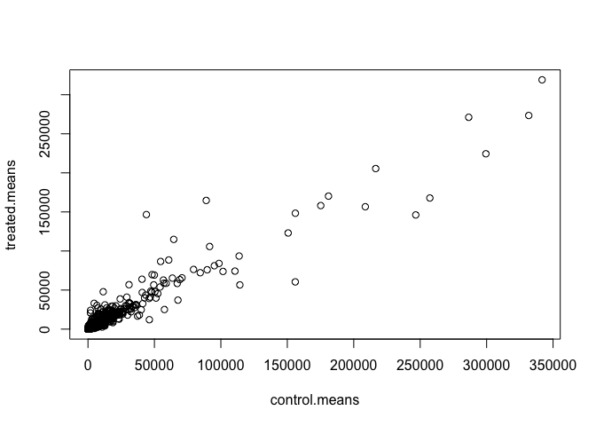
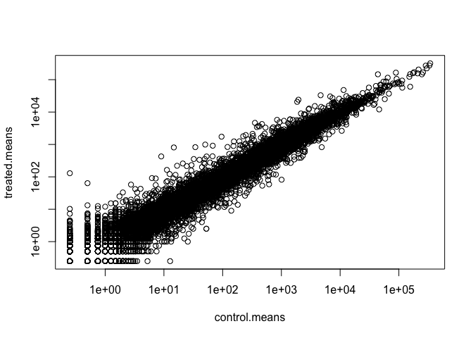
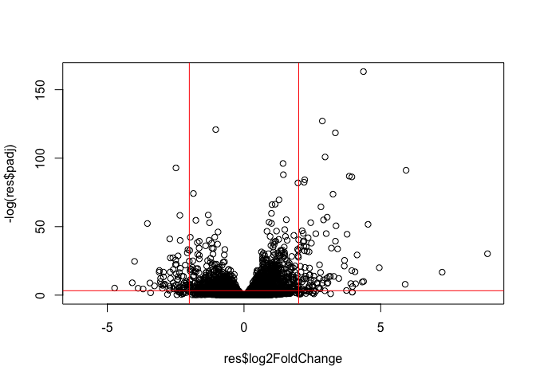

# Class 12: RNASeq Analysis
Nicole (A18116280)

- [Background](#background)
- [Data Import](#data-import)
- [Toy differential gene expression](#toy-differential-gene-expression)
- [Volcano Plot](#volcano-plot)
- [Save our results](#save-our-results)
- [Add gene annotation](#add-gene-annotation)
- [Pathway analysis](#pathway-analysis)
- [Save our main results](#save-our-main-results)

## Background

Today we will analyze some RNASeq data from Himes et al. on the effects
of a common steroid (dexamethasome). on airway smooth muscle cells (ASH
cells).

Are starting point is the “counts” data and “metadata that contain the
count values for each gene in their different experiments (i.e. cell
lines with or without the drug)

## Data Import

``` r
# Complete the missing code
counts <- read.csv("airway_scaledcounts.csv", row.names=1)
metadata <-  read.csv("airway_metadata.csv")
```

``` r
head(counts)
```

                    SRR1039508 SRR1039509 SRR1039512 SRR1039513 SRR1039516
    ENSG00000000003        723        486        904        445       1170
    ENSG00000000005          0          0          0          0          0
    ENSG00000000419        467        523        616        371        582
    ENSG00000000457        347        258        364        237        318
    ENSG00000000460         96         81         73         66        118
    ENSG00000000938          0          0          1          0          2
                    SRR1039517 SRR1039520 SRR1039521
    ENSG00000000003       1097        806        604
    ENSG00000000005          0          0          0
    ENSG00000000419        781        417        509
    ENSG00000000457        447        330        324
    ENSG00000000460         94        102         74
    ENSG00000000938          0          0          0

> Q1. How many genes are in this dataset?

``` r
nrow(counts)
```

    [1] 38694

> Q. How many different experiements (columns in counts or row in
> metadata) are there?

``` r
ncol(counts)
```

    [1] 8

``` r
nrow(metadata)
```

    [1] 8

> Q2. How many ‘control’ cell lines do we have?

``` r
sum( metadata$dex == "control" )
```

    [1] 4

## Toy differential gene expression

To start our analysis let’s calculate the mean counts for all genes in
the “control” experiments.

1.  Extract all “control” columns from the `counts` object
2.  Calculate the mean for all rows(i.e. genes) of these “control”
    columns

3-4. Do the same for “treated” 5. Compare these `control.mean` and
`treated.mean` values.

``` r
control.inds <- metadata$dex == "control"
control.counts <- counts[ , control.inds]
```

> Q3. How would you make the above code in either approach more robust?
> Is there a function that could help here?

``` r
control.means <- rowMeans(control.counts)
```

> Q4. Follow the same procedure for the treated samples (i.e. calculate
> the mean per gene across drug treated samples and assign to a labeled
> vector called treated.mean)

``` r
treated.means <- rowMeans( counts[ , metadata$dex == "treated"] )
```

Store these together for ease of bookkeeping as `meancounts`

``` r
meancounts <- data.frame(control.means, treated.means)
head(meancounts)
```

                    control.means treated.means
    ENSG00000000003        900.75        658.00
    ENSG00000000005          0.00          0.00
    ENSG00000000419        520.50        546.00
    ENSG00000000457        339.75        316.50
    ENSG00000000460         97.25         78.75
    ENSG00000000938          0.75          0.00

> Q5. Make a plot of control vs treated mean values for all genes

``` r
plot(meancounts)
```



> Q6. Make this a log log plot

``` r
plot(meancounts, log="xy")
```

    Warning in xy.coords(x, y, xlabel, ylabel, log): 15032 x values <= 0 omitted
    from logarithmic plot

    Warning in xy.coords(x, y, xlabel, ylabel, log): 15281 y values <= 0 omitted
    from logarithmic plot



> Q7. What is the purpose of the arr.ind argument in the which()
> function call above? Why would we then take the first column of the
> output and need to call the unique() function?

The purpose of the arr.ind argument is that it returns both row and
column indices where the condition is TRUE. Since we only want gene row
numbers, not duplicates, we need to call the unique() function.

We often talk metrics like “log2 fold-change”

``` r
# treated/control
log2(10/10)
```

    [1] 0

``` r
log2(10/20)
```

    [1] -1

``` r
log2(40/10)
```

    [1] 2

``` r
log2(10/40)
```

    [1] -2

Let’s calculate the log2 fold change for our treated over control mean
counts.

``` r
meancounts$log2fc <- log2(meancounts$treated.means /
  meancounts$control.means)
```

``` r
head(meancounts)
```

                    control.means treated.means      log2fc
    ENSG00000000003        900.75        658.00 -0.45303916
    ENSG00000000005          0.00          0.00         NaN
    ENSG00000000419        520.50        546.00  0.06900279
    ENSG00000000457        339.75        316.50 -0.10226805
    ENSG00000000460         97.25         78.75 -0.30441833
    ENSG00000000938          0.75          0.00        -Inf

> Q8. Using the up.ind vector above can you determine how many up
> regulated genes we have at the greater than 2 fc level?

A common “rule of thumb” is a log2 fold change cutoff of +2 and -2 to
call genes “Up regulated” or “Down regulated”.

Number of

``` r
sum(meancounts$log2fc > +2, na.rm=T)
```

    [1] 1846

> Q9. Using the down.ind vector above can you determine how many down
> regulated genes we have at the greater than 2 fc level?

Number of “down” genes at -2 threshold

``` r
sum(meancounts$log2fc <= -2, na.rm=T)
```

    [1] 2330

> Q10. Do you trust these results? Why or why not?

NO, we should not trust these because we compared raw counts, not
normalized counts and the depth of sequencing could differ between
samples. Additionally there is not correction for multiple testing.

\##DESeq2 analysis

Let’s do this analysis properly and keep our inner stats nerd happy -
i.e. are the differences we see between drug and no drug significant
given the replicate experiments.

``` r
library(DESeq2)
```

For DESeq analysis we need three things

- count values (`coutdata`)
- metadata telling us about the columns in `countData` (`colData`)
- design of the experiment (i.e. what do you want to compare)

Our first function from DESeq2 will setup the input required for
analysis by storing all these 3 things together.

``` r
dds <- DESeqDataSetFromMatrix(countData = counts, 
                              colData = metadata, 
                              design = ~dex)
```

    converting counts to integer mode

    Warning in DESeqDataSet(se, design = design, ignoreRank): some variables in
    design formula are characters, converting to factors

The main function in DESeq2 that runs the analysis if called `DESeq()`

``` r
dds <- DESeq(dds)
```

    estimating size factors

    estimating dispersions

    gene-wise dispersion estimates

    mean-dispersion relationship

    final dispersion estimates

    fitting model and testing

``` r
res <- results(dds)
head(res)
```

    log2 fold change (MLE): dex treated vs control 
    Wald test p-value: dex treated vs control 
    DataFrame with 6 rows and 6 columns
                      baseMean log2FoldChange     lfcSE      stat    pvalue
                     <numeric>      <numeric> <numeric> <numeric> <numeric>
    ENSG00000000003 747.194195      -0.350703  0.168242 -2.084514 0.0371134
    ENSG00000000005   0.000000             NA        NA        NA        NA
    ENSG00000000419 520.134160       0.206107  0.101042  2.039828 0.0413675
    ENSG00000000457 322.664844       0.024527  0.145134  0.168996 0.8658000
    ENSG00000000460  87.682625      -0.147143  0.256995 -0.572550 0.5669497
    ENSG00000000938   0.319167      -1.732289  3.493601 -0.495846 0.6200029
                         padj
                    <numeric>
    ENSG00000000003  0.163017
    ENSG00000000005        NA
    ENSG00000000419  0.175937
    ENSG00000000457  0.961682
    ENSG00000000460  0.815805
    ENSG00000000938        NA

``` r
36000 * 0.05
```

    [1] 1800

## Volcano Plot

This is a common summary result figure from these types of experiments
and plot the log2 fold-change vs the adjusted p-value.

``` r
plot(res$log2FoldChange, -log(res$padj))
abline(v=c(-2,2), col="red")
abline(h=-log(0.04), col="red")
```



``` r
log(0.1)
```

    [1] -2.302585

``` r
log(0.000001)
```

    [1] -13.81551

## Save our results

``` r
write.csv(res, file="my_results.csv")
```

## Add gene annotation

To help make sense of our results and communicate them to other folks we
need to add some more annotation to our main `res` object.

We will use two bioconductor packages to first map IDs to different
formats including the classic gene “symbol” gene name.

I will install these with the following commands:
`BiocManager::install("AnnotationDbi")`
`BiocManager::install("org.Hs.eg.db")`

``` r
library(AnnotationDbi)
library(org.Hs.eg.db)
```

Let’s see what is in `org.Hs.eg.db` with the `columns()` functions:

``` r
columns(org.Hs.eg.db)
```

     [1] "ACCNUM"       "ALIAS"        "ENSEMBL"      "ENSEMBLPROT"  "ENSEMBLTRANS"
     [6] "ENTREZID"     "ENZYME"       "EVIDENCE"     "EVIDENCEALL"  "GENENAME"    
    [11] "GENETYPE"     "GO"           "GOALL"        "IPI"          "MAP"         
    [16] "OMIM"         "ONTOLOGY"     "ONTOLOGYALL"  "PATH"         "PFAM"        
    [21] "PMID"         "PROSITE"      "REFSEQ"       "SYMBOL"       "UCSCKG"      
    [26] "UNIPROT"     

We can translate or “map” IDs between any of these 26 databases using
the `mapIds()` function.

``` r
res$symbol <- mapIds(keys = row.names(res), # our current IDs
                     keytype = "ENSEMBL",   # the format of our IDs
                     x = org.Hs.eg.db,      # where to get the mappings from
                     column = "SYMBOL")      # the format/DB to map to
```

    'select()' returned 1:many mapping between keys and columns

``` r
head(res)
```

    log2 fold change (MLE): dex treated vs control 
    Wald test p-value: dex treated vs control 
    DataFrame with 6 rows and 7 columns
                      baseMean log2FoldChange     lfcSE      stat    pvalue
                     <numeric>      <numeric> <numeric> <numeric> <numeric>
    ENSG00000000003 747.194195      -0.350703  0.168242 -2.084514 0.0371134
    ENSG00000000005   0.000000             NA        NA        NA        NA
    ENSG00000000419 520.134160       0.206107  0.101042  2.039828 0.0413675
    ENSG00000000457 322.664844       0.024527  0.145134  0.168996 0.8658000
    ENSG00000000460  87.682625      -0.147143  0.256995 -0.572550 0.5669497
    ENSG00000000938   0.319167      -1.732289  3.493601 -0.495846 0.6200029
                         padj      symbol
                    <numeric> <character>
    ENSG00000000003  0.163017      TSPAN6
    ENSG00000000005        NA        TNMD
    ENSG00000000419  0.175937        DPM1
    ENSG00000000457  0.961682       SCYL3
    ENSG00000000460  0.815805       FIRRM
    ENSG00000000938        NA         FGR

Add the mappings for “GENENAME” and “ENTREZID” and store as
`res$genename` and `res$entrez`

``` r
res$genename <- mapIds(keys = row.names(res),
                     keytype = "ENSEMBL",
                     x = org.Hs.eg.db,
                     column = "GENENAME")
```

    'select()' returned 1:many mapping between keys and columns

``` r
res$entrez <- mapIds(keys = row.names(res),
                     keytype = "ENSEMBL",
                     x = org.Hs.eg.db,
                     column = "ENTREZID")
```

    'select()' returned 1:many mapping between keys and columns

``` r
head(res)
```

    log2 fold change (MLE): dex treated vs control 
    Wald test p-value: dex treated vs control 
    DataFrame with 6 rows and 9 columns
                      baseMean log2FoldChange     lfcSE      stat    pvalue
                     <numeric>      <numeric> <numeric> <numeric> <numeric>
    ENSG00000000003 747.194195      -0.350703  0.168242 -2.084514 0.0371134
    ENSG00000000005   0.000000             NA        NA        NA        NA
    ENSG00000000419 520.134160       0.206107  0.101042  2.039828 0.0413675
    ENSG00000000457 322.664844       0.024527  0.145134  0.168996 0.8658000
    ENSG00000000460  87.682625      -0.147143  0.256995 -0.572550 0.5669497
    ENSG00000000938   0.319167      -1.732289  3.493601 -0.495846 0.6200029
                         padj      symbol               genename      entrez
                    <numeric> <character>            <character> <character>
    ENSG00000000003  0.163017      TSPAN6          tetraspanin 6        7105
    ENSG00000000005        NA        TNMD            tenomodulin       64102
    ENSG00000000419  0.175937        DPM1 dolichyl-phosphate m..        8813
    ENSG00000000457  0.961682       SCYL3 SCY1 like pseudokina..       57147
    ENSG00000000460  0.815805       FIRRM FIGNL1 interacting r..       55732
    ENSG00000000938        NA         FGR FGR proto-oncogene, ..        2268

## Pathway analysis

There are lots of bioconductor packages to do this type of analysis. For
now let’sjust try one called **gage** again we need to install this if
we don’t have it already.

``` r
library(gage)
library(gageData)
library(pathview)
```

To use **gage** I need two things

- a named vector of fold-change values for our DEGs (our geneset of
  interest)
- a set of pathways or genesets to use for annotation.

``` r
x <- c("barry" = 5, "lisa" = 10)
x
```

    barry  lisa 
        5    10 

``` r
names(x) <- c("low", "high")
x
```

     low high 
       5   10 

``` r
foldchanges <- res$log2FoldChange
names(foldchanges) <- res$symbol
head(foldchanges)
```

         TSPAN6        TNMD        DPM1       SCYL3       FIRRM         FGR 
    -0.35070296          NA  0.20610728  0.02452701 -0.14714263 -1.73228897 

``` r
data("kegg.sets.hs")

keggres = gage(foldchanges, gsets=kegg.sets.hs)
```

In our results objects we have:

``` r
attributes(keggres)
```

    $names
    [1] "greater" "less"    "stats"  

``` r
head(keggres$less, 5)
```

                                             p.geomean stat.mean p.val q.val
    hsa00232 Caffeine metabolism                    NA       NaN    NA    NA
    hsa00983 Drug metabolism - other enzymes        NA       NaN    NA    NA
    hsa01100 Metabolic pathways                     NA       NaN    NA    NA
    hsa00230 Purine metabolism                      NA       NaN    NA    NA
    hsa05340 Primary immunodeficiency               NA       NaN    NA    NA
                                             set.size exp1
    hsa00232 Caffeine metabolism                    0   NA
    hsa00983 Drug metabolism - other enzymes        0   NA
    hsa01100 Metabolic pathways                     0   NA
    hsa00230 Purine metabolism                      0   NA
    hsa05340 Primary immunodeficiency               0   NA

Let’s look at one of these pathways with out genes colored up so we can
see the overlap

``` r
pathview(pathway.id = "hsa05310", gene.data = foldchanges)
```

    Warning: None of the genes or compounds mapped to the pathway!
    Argument gene.idtype or cpd.idtype may be wrong.

    'select()' returned 1:1 mapping between keys and columns

    Info: Working in directory /Users/nicolestanichev/Desktop/BIMM143/class15/class12

    Info: Writing image file hsa05310.pathview.png

Add this pathway figure to our lab report


## Save our main results

``` r
write.csv(res, file="myresults_annotated.csv")
```
